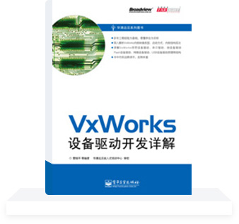

[VxWorks](https://www.vxworks7.com) is a commonly used embedded hard real-time operating system, which is used in many fields. However, since the source code of VxWorks operating system is not open, although the documents explain various driver designs, many problems will still be encountered in practice. This book is written based on the author's driver experience, combined with some official documents and source code in the development environment provided by Wind River. It introduces and analyzes various types of VxWorks device  drivers in detail, which can be used as a guide for device driver design under VxWorks. In addition, it analyzes various types of VxWorks startup methods and image file composition in detail, which will clarify many questions that VxWorks BSP developers have.Buy bestselling books online

[Download](./"Detailed explanation of VxWorks device driver development.pdf")
